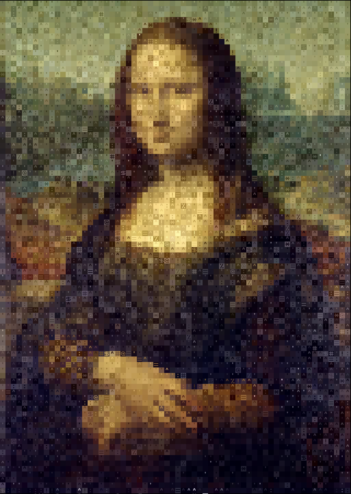
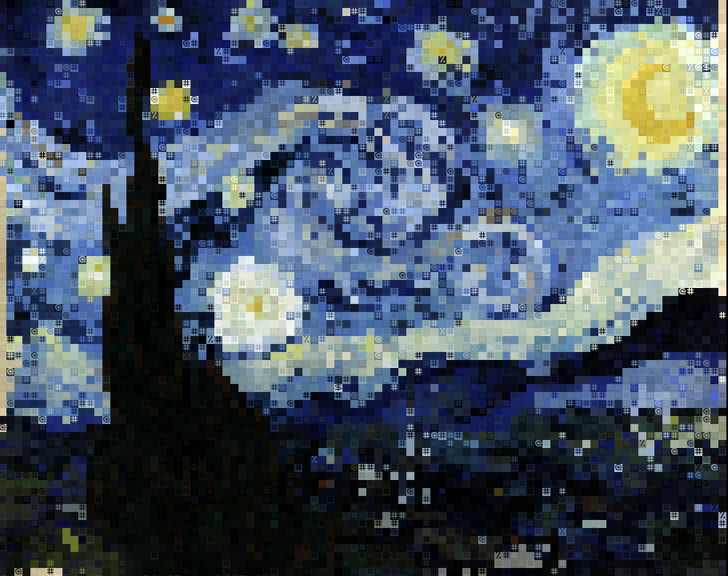

# Image to ANSI converter
A tool for converting images into [ANSI](https://en.wikipedia.org/wiki/ANSI_escape_code) arts. Written in python using Pillow image processing library. The scripts support comand line arguments, so you won't have to modify the code directly. I made this tool due to a lack of "proper" similar tools with sufficient customization and options.

### Requirements
- Python (3)
- baisic knowledge of terminals, filepaths and commandline argument usage.
- Python [Pillow](https://pillow.readthedocs.io/en/stable/) library
- Image in a format that Pillow can open (`.png .jpg .jpeg`)
- Square font, you need a font that is the same size vertically and horizaontally: [SQUARE](https://strlen.com/square/) [Square One](https://www.dafont.com/square-one.font) 

## Usage
As I said, you can use the program entirely form the commandline.

### Setup
I haven't made any advanced setup, so you will have to download a zip of the repo, extract it whereever you want and `cd` into the extracted folder. Prepare the image you want to convert, I recomend placing it into the same folder, but using a filepath to some different location is also supported.

### Use
Type `python3 main.py -h` into the commandline to display the help message.

Here is a summery of the commandline arguments:

`-f --filename` is the filepath to your image, the default image name is image.png.

`-s --sampleSize` Size of the samples, default is 16x16 (the output will be 16x smaller) enter as XxY or just X eg. 12x15 or just 12

`-c --contrast` allows you to change the contrast of the image for better results. (recomended 1 - 1.2 range)

`-cb --contrastbreak` is the border of darkness levels between making a pixel darker or brighter (0-255 recomended range 50-200)

`-b --blur` makes a wider range of colors blend into one. (0-765, 0-200 recomended)

`-o --output` specify output file it can be then displayed with `cat output.txt` with all the colors

`--hide` will prevent the program from printing into the commandline, if you use `--hide` then also use `-o` to save the output

## Palettes
Pallets allow the image to be created using a specific palette. Combined with contrast breaks it can allow to make nice images. It also has an option for specific patterns, those can be used to manipulate the program into outputing a file formatted into something not associated with ANSI.

## Examples

An output file that can be displayed by typing `cat examples/MonaLisa.txt` is also provided.
Original file from [Wikipedia](https://en.wikipedia.org/wiki/Mona_Lisa#/media/File:Mona_Lisa,_by_Leonardo_da_Vinci,_from_C2RMF_retouched.jpg)

Starry Night by Vincent van Gogh with 1.2 contrast and 80 contrast break and sample size 30
Original file from [Wikipedia](https://en.wikipedia.org/wiki/The_Starry_Night#/media/File:Van_Gogh_-_Starry_Night_-_Google_Art_Project.jpg)

## TODO
- [ ] add forground or background only
- [ ] make better output file handler (file formats)
- [ ] improve contrast algorithm
- [ ] make "setsize" instead of sampleSize- it is not user friendly
- [ ] contrast is probably messing with the sampling algorithm
- [ ] better character sets
- [ ] add nocolor
- [ ] pattern is very wonky in for the foreground and background only features
- [ ] add bold, italic etc. 
