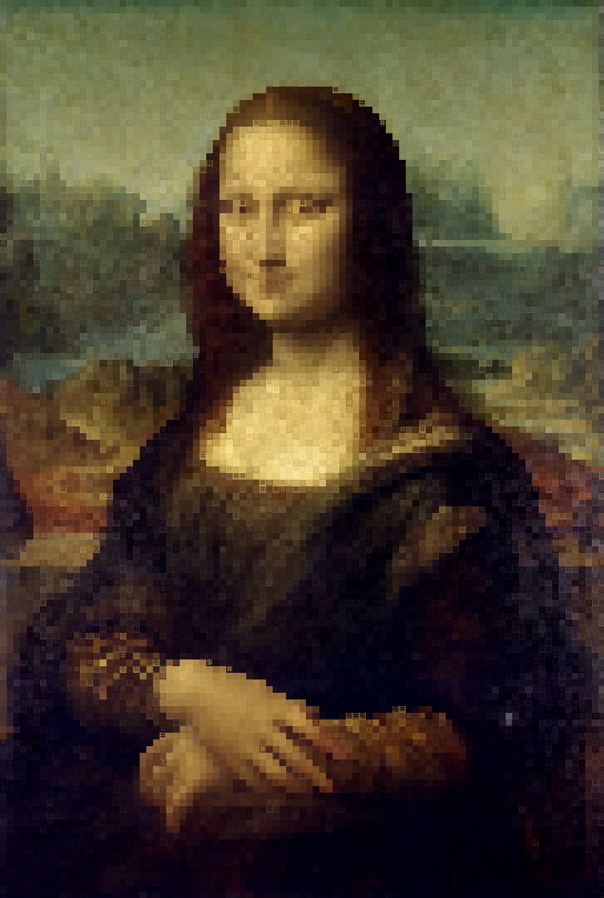

# Image to ANSI converter
A tool for converting images into [ANSI](https://en.wikipedia.org/wiki/ANSI_escape_code) arts. Written in python using Pillow image processing library. The scripts support comand line arguments, so you won't have to modify the code directly. I made this tool due to a lack of "proper" similar tools with sufficient customization and options.

### Requirements
- Python (3)
- baisic knowledge of terminals, filepaths and commandline argument usage.
- Python [Pillow](https://pillow.readthedocs.io/en/stable/) library
- Image in a format that Pillow can open (`.png .jpg .jpeg`)
- Square font, you need a font that is the same size vertically and horizaontally: [SQUARE](https://strlen.com/square/) or [Square One](https://www.dafont.com/square-one.font)

Requirements you probably already have:
- python yaml library

## Usage

### Setup
I haven't made any advanced setup, so you will have to download a zip of the repo from the [releases](https://github.com/andrei-akopian/Image-to-ANSI-Converter/releases) (because everything is currently probably broken) , extract it wherever you want and `cd` into the extracted folder. Prepare the image you want to convert, I recomend placing it into the same folder, but using a filepath to some different location is also supported.

### Use
Run the `main.py` file with the cli arguments arguments

Type `python3 main.py -h` into the commandline to display the help message.

**Here is a summery of the commandline arguments:**

**Basic**

`-f --filename` is the filepath to your image, the default image name is image.png.

`-s --sampleSize` Size of the samples, default is 16x16 (the output will be 16x smaller) enter as XxY or just X eg. 12x15 or just 12

`-os --outputSize` Instead of messing with sampleSizes you can specify the size of the output image directly (in characters.) Same as sample size: WxH eg. 40x50 (40 wide, 50 tall)

**Save to a file**

`-o --output` specify output file it can be then displayed with `cat output.txt` with all the colors

`--hide` will prevent the program from printing into the commandline, if you use `--hide` then also use `-o` to save the output

**Manipulated**

`-c --contrast` allows you to change the contrast of the image for better results. (recomended 1 - 1.2 range)

`-cb --contrastbreak` is the border of darkness levels between making a pixel darker or brighter (0-255 recomended range 50-200)

`-b --blur` makes a wider range of colors blend into one. (0-765, 0-200 recomended)

**Apperance**

`-p --palettename` enter name of the palette you want to use. `3`,`4` and `8-bit.json` are default palettes in the palettes folder. Use formatting guide in `paletteNotes.md` to mak your own.

`-pf --filterpalettename` enter name of the palette with filter points you want to use (filters colors). Because the 3-bit filterpalette can filter out the entire image, you should use filters only when using a palette (Ik it's quite useless).

`-char --characters` enter string of characters to be used in the art instead of the default one sorted light to dark.

`-charf --characterfile` enter filename.txt with characters to be used sorted light to dark.

`-nbg --nobackground` creates an image with only the symbols colored. A custom background color can be entered eg: `-nbg="255;255;255"` (if using palette, it has to be copatible with the palette monopattern).

`-nfg --noforeground` creates an image without symbols, only background pixels

## Palettes
Pallets allow the image to be created using a specific palette. Combined with contrast breaks it can allow to make nice images. It also has an option for specific patterns, those can be used to manipulate the program into outputing a file formatted into something not associated with ANSI.

## Examples

An output file that can be displayed by typing `cat examples/MonaLisa.txt` is also provided.
Original file from [Wikipedia](https://en.wikipedia.org/wiki/Mona_Lisa#/media/File:Mona_Lisa,_by_Leonardo_da_Vinci,_from_C2RMF_retouched.jpg)

Starry Night by Vincent van Gogh with 1.2 contrast and 80 contrast break and sample size 30
Original file from [Wikipedia](https://en.wikipedia.org/wiki/The_Starry_Night#/media/File:Van_Gogh_-_Starry_Night_-_Google_Art_Project.jpg)

## TODO
- [ ] make better output file handler (file formats)
- [ ] generate output images so user doesn't have to screenshort them
- [ ] improve contrast algorithm
- [ ] make "setsize" instead of sampleSize- so it is not user friendly
- [ ] contrast is probably messing with the sampling algorithm
- [ ] better character sets arguments
- [ ] add nocolor
- [ ] add bold, italic etc. 
- [ ] allow passing arguments through a file `-cf` (.yaml or .json)
- [ ] add svg character selector
- [ ] add support for UTF-8 characters
- [ ] add something about terminal size
- [ ] add csv export of pixels
- [ ] maybe try writing to the file as the program is running
- [ ] some kind of chaching&optimization or lossy compression
- [ ] potentially use median colors
- [ ] better cli
- [ ] figure out the `.ans` file format and maybe make use of it
- [ ] display size of the output file
